# 智能记账 App

这是一个前后端分离的移动端记账项目，由 Android 客户端和 Spring Boot 后端组成。用户可以注册登录、维护个人资料、记录收入和支出、按月份查看账单列表与收支统计，并通过上传账单截图进行智能识别，辅助生成记账记录。

## 项目结构

```text
.
├── project1-front/   # Android 客户端
└── project1-server/  # Spring Boot 后端服务
```

## 功能介绍

- 用户账号：注册、登录、JWT 鉴权、查看和修改个人资料。
- 账单管理：新增、编辑、删除、按月份查询收入/支出记录。
- 数据统计：按月份汇总收入、支出和结余，统计用户账单数量。
- 智能识别：上传 JPG、PNG 或 WebP 格式账单截图，调用通义千问兼容接口识别账单类型、类别、金额、日期和备注。
- 移动端交互：Android 原生界面，Retrofit 调用后端接口，底部导航切换首页、记账和个人中心。

## 系统架构图

<p>
  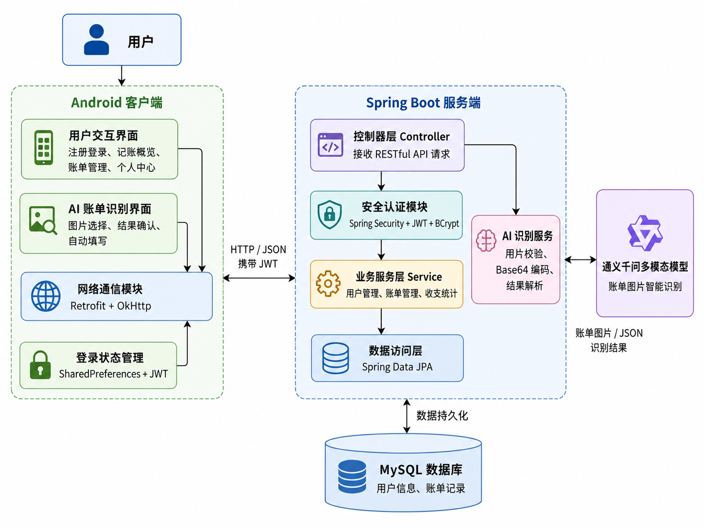
</p>

## App 功能截图

<p>
  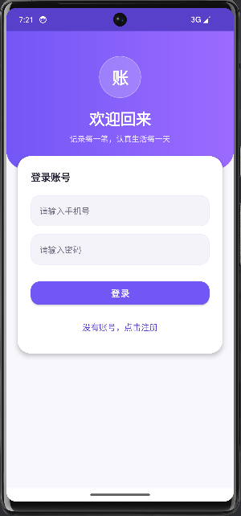
  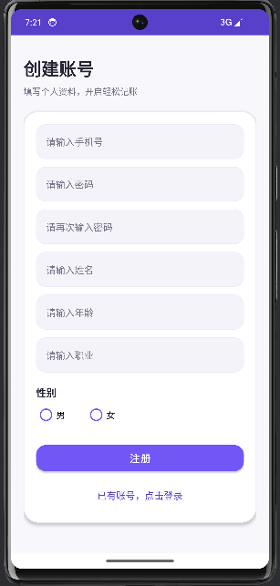
  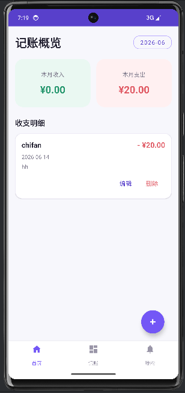
</p>

<p>
  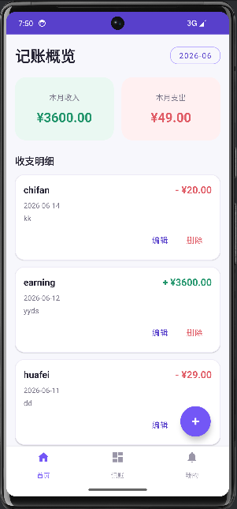
  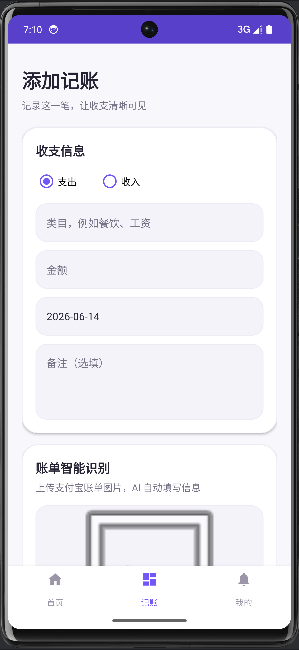
  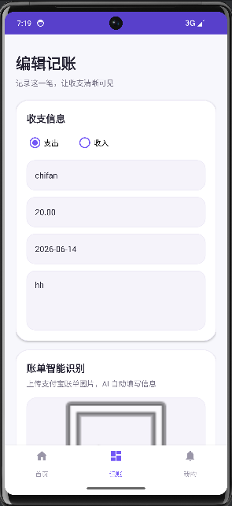
</p>

<p>
  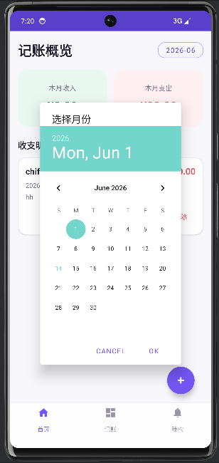
  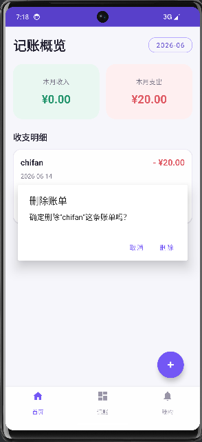
  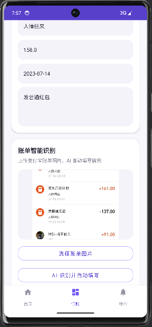
</p>

<p>
  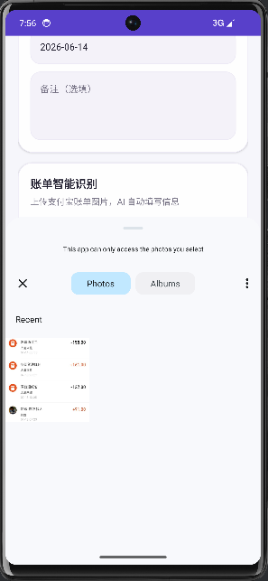
  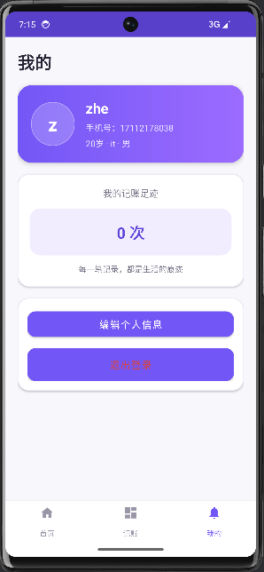
  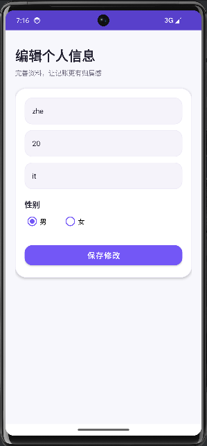
</p>

## 技术栈

### Android 客户端

- Java
- Android Gradle Plugin
- AppCompat / Material Components
- ViewBinding
- Navigation
- Retrofit + Gson
- OkHttp

### 后端服务

- Java 17
- Spring Boot
- Spring Web
- Spring Data JPA
- Spring Security
- JWT
- MySQL
- Maven

## 环境要求

- JDK 17
- Maven 3.8+
- MySQL 8.x
- Android Studio
- Android SDK 33

## 后端运行

1. 创建 MySQL 数据库：

```sql
CREATE DATABASE project1 DEFAULT CHARACTER SET utf8mb4 COLLATE utf8mb4_unicode_ci;
```

2. 配置环境变量：

```powershell
$env:DB_URL="jdbc:mysql://localhost:3306/project1?useUnicode=true&characterEncoding=utf8&serverTimezone=Asia/Shanghai&useSSL=false"
$env:DB_USERNAME="root"
$env:DB_PASSWORD="你的数据库密码"
$env:JWT_SECRET="请替换为足够长的随机密钥"
$env:DASHSCOPE_API_KEY="你的 DashScope API Key"
```

3. 启动后端：

```powershell
cd project1-server
.\mvnw.cmd spring-boot:run
```

默认服务地址为：

```text
http://localhost:8080
```

## Android 客户端运行

1. 使用 Android Studio 打开 `project1-front`。
2. 等待 Gradle 同步完成。
3. 启动后端服务。
4. 使用模拟器运行 App。

客户端默认请求地址为：

```text
http://10.0.2.2:8080/
```

`10.0.2.2` 是 Android 模拟器访问宿主机 `localhost` 的地址。如果使用真机调试，需要把 `project1-front/app/src/main/java/com/example/project1/network/ApiClient.java` 中的 `BASE_URL` 改为电脑在局域网中的 IP 地址。

## 主要接口

### 用户接口

| 方法 | 路径 | 说明 |
| --- | --- | --- |
| POST | `/api/users/register` | 用户注册 |
| POST | `/api/users/login` | 用户登录 |
| GET | `/api/users/me` | 获取当前用户信息 |
| PUT | `/api/users/me` | 修改当前用户信息 |
| DELETE | `/api/users/me` | 删除当前用户 |

### 账单接口

| 方法 | 路径 | 说明 |
| --- | --- | --- |
| POST | `/api/records` | 新增账单 |
| GET | `/api/records?month=yyyy-MM` | 按月份查询账单 |
| PUT | `/api/records/{recordId}` | 修改账单 |
| DELETE | `/api/records/{recordId}` | 删除账单 |
| GET | `/api/records/summary?month=yyyy-MM` | 获取月度统计 |
| GET | `/api/records/count` | 获取账单数量 |
| POST | `/api/records/recognize` | 上传图片识别账单 |

除注册和登录外，其他接口需要在请求头中携带：

```text
Authorization: Bearer <JWT_TOKEN>
```

## 配置说明

后端配置文件位于：

```text
project1-server/src/main/resources/application.properties
```

推荐通过环境变量注入敏感配置，不要把真实密码、JWT 密钥或 API Key 提交到 GitHub。

| 环境变量 | 说明 |
| --- | --- |
| `DB_URL` | MySQL 连接地址 |
| `DB_USERNAME` | MySQL 用户名 |
| `DB_PASSWORD` | MySQL 密码 |
| `JWT_SECRET` | JWT 签名密钥 |
| `DASHSCOPE_API_KEY` | 通义千问/DashScope API Key |
| `QWEN_MODEL` | 账单识别模型名称 |
| `QWEN_BASE_URL` | 兼容 OpenAI 格式的 DashScope 地址 |

## GitHub 上传建议

首次上传可以在项目根目录执行：

```powershell
git init
git add .
git commit -m "Initial commit"
git branch -M main
git remote add origin https://github.com/<你的用户名>/<仓库名>.git
git push -u origin main
```

如果曾经把真实 API Key 提交进 Git 历史，请先删除远端仓库或清理提交历史，并立即在对应平台重置该 Key。
